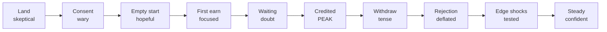

# Feul ([PRODUCT]) — User Journey Map

> Repo: `D:\portfolio porjects\feul final build\Feulmobile-main` (branch `master`) · Documented 2026-09-16 from latest code + repo direction docs.
> **Basis & honesty note:** no original user research exists in the repo. Journeys below are **inferred from the product's own economic design** (`PORTFOLIO-DIRECTION.md`, `plans/03-EDGE-CASES.csv` copy direction, quest/pay model in `lib/quests.ts`) — they model the *intended* experience the screens were built for. Empathy quadrants live in [03-empathy-maps](03-empathy-maps.md). Screen IDs per [04-information-architecture](04-information-architecture.md).

## Persona journeyed

**Primary: the contributor** — an Indian gig earner supplying voice data (labs buy coverage: speaker × dialect × district × acoustic condition). Income is real money (₹-denominated payouts, UPI settlement); stakes include shared time (room takes) and legal identity (DPDP consent). The validator journey is covered separately at the end.

## Journey 1 — Contributor: from install to steady earning

### Stage table

| Stage | Contributor does (screens) | Thinks (inferred) | Emotion | Pain point the design answers |
|---|---|---|---|---|
| 1. Land & trust | Reads market pitch, signs in (FEU-00–01), picks language (FEU-02) | "Is this a real job or a scam app? Will my phone work?" | Skeptical → curious | Opaque earning claims; **answer:** coverage economics visible per job, not vague promises |
| 2. Consent gate | Sees mic prime + DPDP consent as its **own full screen** (FEU-03) | "Why do you need my voice? What happens to it?" | Wary | Consent buried in onboarding; **answer:** consent is a route, not a sheet (D-3) — "must not look like a step inside the app you are being asked to trust" |
| 3. Empty start | Home day-0 (FEU-04): one honest first job CTA | "What do I do first? What will I earn?" | Hopeful, uncertain | Blank dashboards; **answer:** guaranteed ≥1 open LINES row (C-22), first job pre-picked |
| 4. First earn | Brief → capture → review → submit (FEU-08–13): pay breakdown visible (base × coverage + bonus) | "How long is this? Is the pay fair? Did I do it right?" | Focused → anxious-at-submit → relieved | Hidden math; **answer:** questTotal = base × coverageMult + bonus shown on every row/brief |
| 5. Wait & see | Home pending (FEU-05): submission "Clearing" | "Did it pass? When do I get money?" | Anticipation, low-grade doubt | Silent review periods; **answer:** pending state is explicit with in-review total, notifications badge = 1 |
| 6. First credit | Celebration / quiet credit (FEU-40/39) → Home live (FEU-06) "Earned today" | "It's real. Money moved." | Peak — validation | Never seeing the moment money arrives; **answer:** two-cadence credit design (session celebration + quiet in-flow award) |
| 7. Withdraw | Wallet (FEU-26) → payout machine (FEU-27–31) | "Will UPI eat my money? What if name doesn't match?" | Tense (money at stake) | Failed silent payouts; **answer:** name-match honesty gate, receipt with ref, failure keeps money available (C-23) |
| 8. Rejection moment | Repair Studio (FEU-16): sentence + why + fix | "What did I do wrong? Is my other work wasted?" | Deflated → oriented | Silent penalties; **answer:** shared taxonomy, accepted clips preserved (C-12), 7-day appeal (C-09) |
| 9. Edge shocks | Coverage full (FEU-18), dialect flag (FEU-21), campaign closed (FEU-19) | "Why locked? Was I cheated? Will I still be paid?" | Frustrated → respected | Locked doors with no exit; **answer:** every rejection pairs with a redirect; in-flight submissions honoured (C-03/C-16) |
| 10. Steady state | Live Home (FEU-06): streaks, milestones, standing tier | "Where's my next good job? Am I moving up?" | Confident, strategic | Progression opacity; **answer:** standing (access + settlement speed, never clip pay — same work same pay) + craft per format×language |

### Emotional curve (journey 1)

**Design intent observed:** the curve is engineered to bottom out *safely* — the two tense dips (waiting, withdraw) and two deflations (rejection, edge shocks) each have a purpose-built state (FEU-05, FEU-27–31, FEU-16, FEU-18/21/19) rather than silence.

## Journey 2 — Room-take evening (the highest-stakes micro-journey)

| Beat | What happens | Emotion | Designed answer |
|---|---|---|---|
| Assemble | 4 people, one phone, one continuous take (format `room`) | Occasion — "don't waste everyone's time" | Roll-call consent on tape incl. under-18 gate (FEU-17, C-01/C-10) |
| Pre-flight | Battery <20% → warn before starting (FEU-25, C-15) | Impatience vs prudence | "A 25-min take may not survive. Plug in?" |
| Mid-take | Phone call at min 19 of 25 → interruption (FEU-22, C-04) | Panic → relief | "Your 19-min take is saved. Resume in 24h." — stakes named, not tech |
| Review | One speaker silent (FEU-23, C-08) | Awkward → clear | 4-lane timeline, one empty; retake or remove, pay consequence shown |
| Pay-off | Submission honoured even if campaign closes (FEU-19, C-16) | Trust | Platform absorbs lab withdrawal; contributor still paid |

This micro-journey is where the product's empathy is most visible: **every guard exists because failure costs four people's evening, not one.**

## Journey 3 — Validator (companion role)

Apply (FEU-38) → grade batches (FEU-41–43, undo toast) → disagree → escalate to 3rd reviewer (FEU-44) → accuracy drift → privately warned, throttled, suspended (FEU-45 — "never accuse") → queue empty → offered contributor work instead (FEU-46). Emotional design: accountability without humiliation; the validator is scored invisibly and spoken to honestly.

## Pain-point → design-answer index (quotable)

| Pain point (journey) | Design answer (screen/state) |
|---|---|
| Consent anxiety | Native consent route (D-3), plain-language DPDP copy (`lib/consentCopy.ts`), revocation keeps settled money (FEU-57, C-05) |
| Opaque pay | Coverage math on every brief; rarity premium explained as 1.6× scarcity (FEU-18 redirect copy) |
| Silent waiting | Explicit pending states with in-review totals; honest "reviewers disagreed" pending (C-17) |
| Rejection shame | Sentence + why + fix taxonomy; appeal window; no silent penalties (C-12/C-09) |
| Lost work | Local persistence + 24 h resume (C-04); offline queue keeps clips (C-11); noise pause never discards (C-14) |
| Fraud fear (both directions) | UPI name-match, spoofing hold with appeal (C-06), dialect honesty check (C-07), invisible validator scoring (C-18), role-collision lockout |

*All rows trace to code or the owner's ledger; no user interviews exist — treat emotions as the design's intended model, flagged for validation if real research lands later.*
