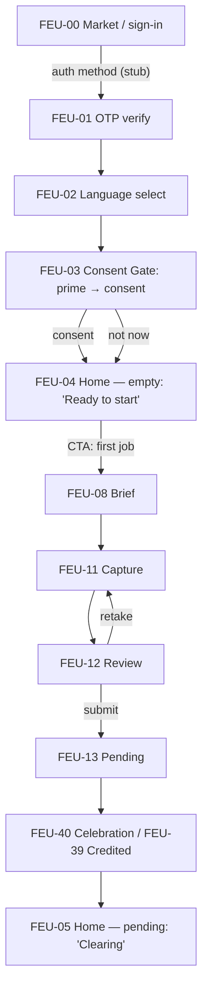
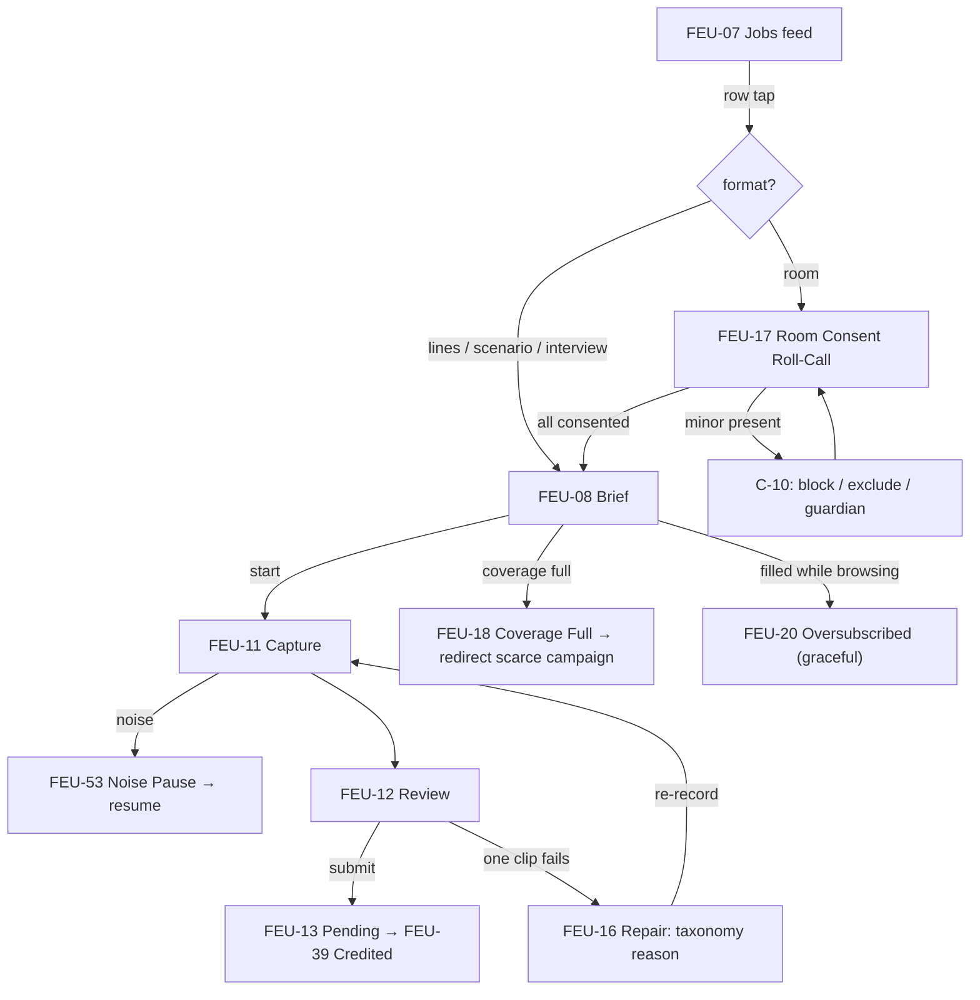
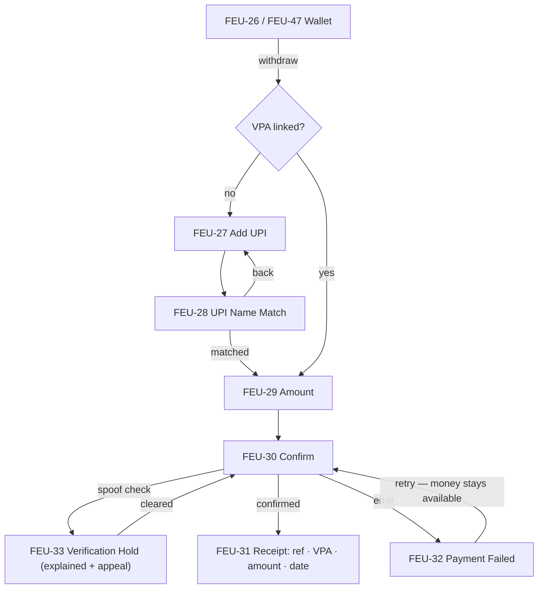

# Feul ([PRODUCT]) — User Flows

> Repo: `D:\portfolio porjects\feul final build\Feulmobile-main` (branch `master`) · Documented 2026-09-16 from latest code.
> Screen IDs are defined in [04-information-architecture](04-information-architecture.md); states in [05-state-path-catalog](05-state-path-catalog.md). All flows reconstructed from actual navigation code (`routes.tsx`, component `navigate()` calls) — nothing invented.

## Flow map — the six core flows at a glance

| # | Flow | Path skeleton | Key decision points | End states |
|---|---|---|---|---|
| F1 | First earn (day 0) | FEU-00..02 → FEU-03 → FEU-04 → FEU-08..13 → FEU-40/39 → FEU-05 | auth method; consent now/later; guard branches | pending Home / abandoned |
| F2 | Record a job (repeat) | FEU-07 → (room? FEU-17) → FEU-08..13 → FEU-16/39 | format branch; guards; retake | pending / rejected→repair |
| F3 | Withdraw earnings | FEU-26 → FEU-27..31 (shared) | VPA linked?; name match; spoof hold; failure | receipt / retry |
| F4 | Handle rejection | FEU-16 → re-record or dispute (FEU-24) | recoverable vs structural reason | resubmitted / appealed |
| F5 | Room take (highest stakes) | FEU-07 → FEU-17 (+C-10 minor) → FEU-08 (battery C-15) → capture (interruption C-04, noise C-14) → FEU-12 (silent speaker C-08) | every guard | submitted / resumed / retake |
| F6 | Validator loop | FEU-38 apply → FEU-41/42 → FEU-43 → FEU-44/45/46 → FEU-47 | flag path; queue empty cross-subsidize | graded / escalated |

## F1 — First earn (day-0 journey)

**Decision points:** auth method choice; consent commit vs "not now" (both land on Home — consent never traps); guard chain before capture (FEU-09 consent sheet if un-consented, FEU-10 mic prime once-ever). **Exit states:** pending Home (earned, clearing) or drop-off at any step. Retired funnel steps (calibration etc.) fold into this flow as redirects.

## F2 — Record a job (repeat earn)

**Decisions:** format branch (room → roll-call); coverage-full honest redirect (C-02); in-session guards; per-clip rejection loop. **End:** pending → credited (quiet mid-session award) or repair loop.

## F3 — Withdraw earnings (shared contributor/validator machine)

**Decisions:** linked/not; name-match honesty gate (sets `upiNameMatched`); spoofing hold. **End states:** success receipt + share, or retryable failure (C-23: one sentence + why + what to do).

## F4 — Rejection handling (accountability loop)

RejectedTask (FEU-16) renders the shared taxonomy (`lib/rejectionTaxonomy.ts`): each reason = sentence + why + fix; `recoverable: true` (noise, clipping, wrong-language, script-deviation, overlap, duration) → re-record CTA; `recoverable: false` (synthetic → appeal; consent-missing → re-consent/retake). Disputes over *grades* (not rejections) run through FEU-24: 7-day window → 3rd reviewer → honest result → back to Wallet.

## F5 — Room take (highest-stakes flow)

Stakes named by the ledger itself: *"₹220 + 4 people's evening"*. Chain: Jobs → FEU-17 roll-call (C-01 on-tape consent; C-10 under-18 block) → Brief with battery pre-check (FEU-25, C-15: "a 25-min take may not survive") → capture with noise pause (FEU-53) → **interruption safety net** (FEU-22: take saved locally, resume ≤24 h from Home row, duration preserved) → review with 4-lane speaker timeline (FEU-23, C-08 silent-speaker retake/remove) → submit. Every guard exists because a failure here costs four people's time, not one.

## F6 — Validator loop

Profile (FEU-36) → Validator Application (FEU-38) → approval → `/validator` dock. Home (FEU-41) pending batches → Grading (FEU-43; segmented instrument ships; 4 dev variants; undo toast) → flag path → Disagreement Escalation (FEU-44, C-17) ; accuracy drift → private warning → throttle → suspension (FEU-45, C-18); empty queue → cross-subsidize to contributor jobs (FEU-46, C-19) → Validator Wallet (FEU-47) → same payout machine (F3).

## Flow-design rules worth quoting

1. **Honest redirect over locked card** — rejection states route somewhere useful (C-02 scarce-campaign redirect; C-19 contributor CTA from empty validator queue).
2. **Money never moves through an unexplained state** — name-match before payout, spoof hold explained with timeline and appeal, failure keeps money available.
3. **Session continuity is a designed state, not a error** — interrupted room takes persist with duration and a 24 h resume window.
4. **One machine, two roles** — payout and reward-claim flows are literally shared components with role-aware back-paths.
