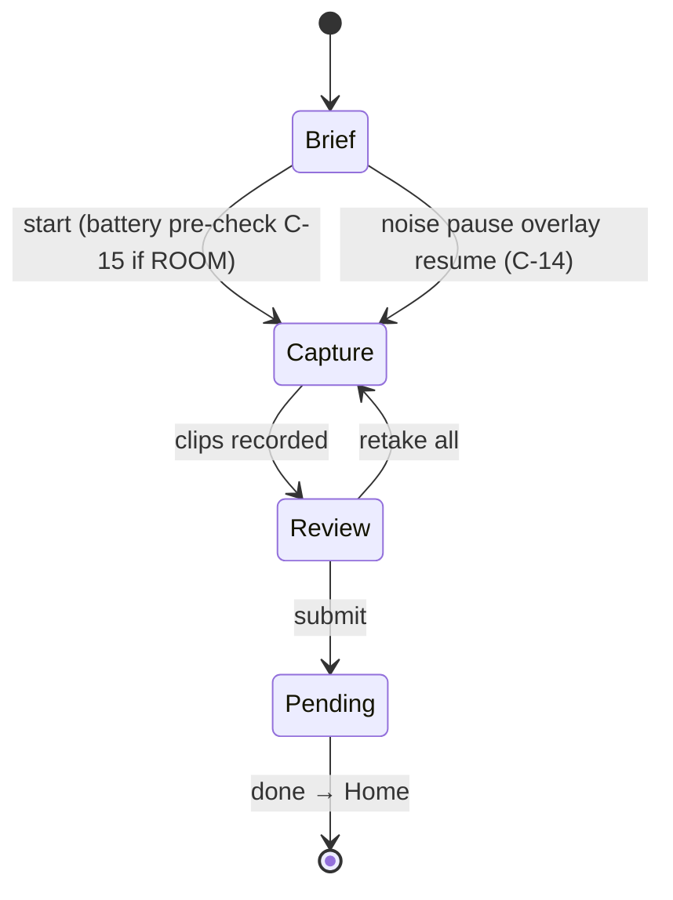
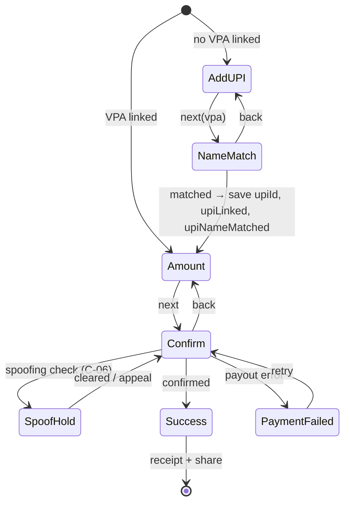

# Feul ([PRODUCT]) — App State & Path Catalog

> Repo: `D:\portfolio porjects\feul final build\Feulmobile-main` (branch `master`) · Documented 2026-09-16 from latest code.
> Every state below is traceable to code (`src/app/lib/session.ts`, `DevContext.tsx`, component files) or to the owner's edge-case ledger (`plans/03-EDGE-CASES.csv`). Screen IDs defined in [04-information-architecture](04-information-architecture.md).

## 1. Global persistent state (observed: `lib/session.ts`, localStorage)

| State object | Fields / values | Governs |
|---|---|---|
| `FeulProfile` | `stage: 'day0' \| 'session' \| 'credited'` | Home data-state derivation (FEU-04/05/06) |
| | `verification: 'unverified' \| 'pending' \| 'verified' \| 'hold'` | Spoofing hold, UPI name-match surfaces |
| | `standing.level 1–4` (New·Verified·Trusted·Elite) + `reliability 0–100` | Campaign access + settlement speed — **never clip pay** (`lib/tier.ts`, fixed duplicate-Elite bug noted in code) |
| | `craft[format:language] 0–100` | Demonstrated skill per format×language |
| | `upiLinked / upiNameMatched / upiId` | Payout machine entry step (FEU-27 vs FEU-29) |
| | `micPrimed: boolean` | Once-ever mic prime (FEU-10) shown only on first capture |
| | `walletBalance` | Wallet, payout, Home hero |
| | `consentLang`, `languages[]` | Language step (FEU-02), dialect checks (C-07) |
| Consent flag | localStorage `'1'` | Consent Gate (FEU-03) skipped when set; drives Onboarding redirect target |
| Dev session state | `DevContext` (not persisted) | Overlays launcher + state toggles (FEU-51) |

## 2. Recording session machine — `/recording/:questId` (FEU-08..15)

Guards run before beats, in code order: bad id → **FEU-15 NotFound**; `available === false` → **FEU-14 WaitingForPrompts**; no consent this session → **FEU-09 ConsentSheet**; never primed → **FEU-10 MicPermissionPrime**.

| From | Event | To | Evidence |
|---|---|---|---|
| FEU-08 Brief | start | FEU-11 Capture | `setBeat('capture')` |
| FEU-11 Capture | noise floor too high | FEU-53 overlay (pause+resume, never discard) | C-14, `AcousticNoisePause.tsx` |
| FEU-11 Capture | phone call / background / battery death | FEU-22 Session Interrupted (take saved, resume 24 h) | C-04 |
| FEU-11 Capture | done | FEU-12 Review | `onDone → setBeat('review')` |
| FEU-12 Review | silent speaker (room) | FEU-23 Silent Room Review (retake / adjust) | C-08 |
| FEU-12 Review | retake all | FEU-11 | `onRetakeAll` |
| FEU-12 Review | submit | FEU-13 Pending | `submit → setBeat('pending')` |
| FEU-13 Pending | done | FEU-04 Home | `onHome` |
| any beat | back | Jobs FEU-07 / previous | `navigate(-1)` + swipe |

Post-review paths: **FEU-16 Rejected/Repair** (taxonomy: noise · clipping · wrong-language · script-deviation · overlap · duration · synthetic · consent-missing; 6 recoverable, 2 structural — synthetic appealable, consent-missing re-consent) → re-record (`/recording/q-scen-3` observed). **FEU-39 Credited** (quiet mid-session award) · **FEU-40 Celebration** (session total). Quality dispute → FEU-24 (7-day appeal window → 3rd reviewer → honest result).

## 3. Payout machine — `/contributor/payout` & `/validator/payout` (shared `PayoutFlow.tsx`)

Entry step is stateful: `linked ? 'amount' : 'add-upi'`.

| State | Screen | Notes (observed) |
|---|---|---|
| add-upi | FEU-27 | First-withdrawal only; first-withdrawal floor shown as gap (C-23) |
| name-match | FEU-28 | VPA-holder vs profile name; mismatch = honest fraud check before money moves |
| amount | FEU-29 | Amount entry |
| confirm | FEU-30 | Review + confirm; can trigger FEU-33 Spoofing Hold (explained, appealable, timeline) |
| success | FEU-31 | Receipt: ref number, VPA, amount, arrival date, share |
| failed | FEU-32 | Retry keeps money available (C-23) |

## 4. Home data-state machine (FEU-04/05/06)

`state = profile.stage` mapped: `day0 → empty` · `session → pending` · `credited → live` (or forced via DevPanel). Transitions: empty → pending on first submission; pending → credited on first credit (celebration/credited screens are the visible hinges). Notifications badge follows state: 0/1/3 unread.

## 5. Onboarding & consent paths

| Path | Chain | Evidence |
|---|---|---|
| Fresh user | FEU-00 market → FEU-01 OTP → FEU-02 language → FEU-03 Consent (prime→consent) → FEU-04 | `Onboarding.tsx` step machine; `ConsentGate.tsx` step machine (`prime` ↔ `consent`) |
| Returning, consented | FEU-00 → `/contributor` (skip consent) | `hasConsented()` branch |
| Signed-out proof URL | `/contributor/consent` directly → consent, never mic | route comment D-3 |
| "Not now" | FEU-03 → FEU-04 | `notNow()` |

## 6. Edge-case state registry (ledger C-01…C-23 ↔ screens)

| C-ID | Trigger | UI state | Screen | Design answer (ledger) |
|---|---|---|---|---|
| C-01/C-10 | ROOM with 3 non-users; minor present | Roll-call before record; under-18 block/exclude/guardian | FEU-17 | On-tape consent; DPDP every speaker is a data principal |
| C-02 | Demographic quota met | Honest rejection + redirect to scarce campaign (1.6×) | FEU-18 | Pair every rejection with a redirect |
| C-03/C-16 | Campaign closes mid-session / cancelled post-submit | Card flips filled; honour-notice; in-flight paid, platform absorbs lab withdrawal | FEU-19 | Promise visible: in-flight honoured |
| C-04 | Call at min 19 of 25 | Take saved, resume ≤24 h, duration preserved | FEU-22 | Name stakes (₹220 + 4 people's evening), not tech |
| C-05 | Consent revoked post-payment | Revocation receipt; ledger row struck; settled money kept | FEU-57 | Data deleted, money not clawed back |
| C-06 | TTS/synthetic suspected | Verification hold: what/next/timeline/appeal | FEU-33 | Never silent penalty |
| C-07 | Rarity gaming (dialect claim) | Flag before payout; pay adjusts to base, honest copy | FEU-21 | Honest check, not accusation |
| C-08 | One of 4 speakers silent | 4-lane timeline, one lane empty; retake/remove | FEU-23 | Name it + pay consequence |
| C-09 | Grade reduces bonus | 7-day appeal → 3rd reviewer → result | FEU-24 | Bounded accountability window |
| C-11 | Network drops after submit | Clips queued locally, retry, count preserved | FEU-55 | Trust moment: don't discard |
| C-12 | One clip of 8 fails | Repair Studio, shared taxonomy both directions | FEU-16 | Keep accepted clips; one closed reason list |
| C-13 | Record w/o permission | Rationale + OS settings deep link | FEU-56 | Explain why, not generic dialog |
| C-14 | Noise floor high mid-record | Pause overlay + level meter + guidance | FEU-53 | Don't discard |
| C-15 | Battery <20% before ROOM | Pre-check at Brief; plug-in / cancel | FEU-25 | Warn before 25-min stake |
| C-17 | Validators disagree | Escalation to 3rd; honest pending copy | FEU-44 | "Worth building — honest version of a loading state" |
| C-18 | Gold-standard agreement drops | Private warning → throttle → suspension | FEU-45 | Invisible scoring, never accuse |
| C-19 | Validator queue empty | Cross-subsidize → contributor CTA | FEU-46 | Roles cross-subsidize |
| C-20 | No campaigns match | Honest empty: name supply gap + notify | — (copy in feed) | Never spinner |
| C-21 | Slots fill while browsing | Live slot count → filled, graceful | FEU-20 | Not an error |
| C-22 | All campaigns tier-locked | ≥1 LINES row always eligible; TierGate aspirational | — (rule) | Guarantee one open row |
| C-23 | Wrong-language / duplicate / daily-limit / UPI fail | Inline message + why + corrective CTA | FEU-59, FEU-32 | One clear sentence + what to do |

Additional dev-launchable overlays observed: FEU-54 Batch Expired, FEU-58 Role Collision Lockout.

## 7. Validator states (FEU-41..49)

Grading instrument: ships `segmented`; dev-preview variants `pills`, `arc`, `keyboard`, `binary` (`grading-variants/`); undo toast on grade actions. Home empty / tasks empty / wallet empty toggles exist (dev) mirroring C-19/C-20 honesty patterns. Disagreement escalation takes optional taskId (`/validator/disagreement/:taskId?`).

## 8. Complete screen ↔ state cross-reference

Every FEU ID and its states (— = single stable state; IDs match IA §3 exactly):
FEU-00 (market) · FEU-01 (otp) · FEU-02 (language) · FEU-03 (prime | consent) · FEU-04 (empty) · FEU-05 (pending) · FEU-06 (live) · FEU-07 (list | honest-empty C-20 | tier-locked rows C-22) · FEU-08 (brief | battery-warning C-15) · FEU-09 (sheet) · FEU-10 (prime) · FEU-11 (capture | noise-paused) · FEU-12 (review | silent-speaker) · FEU-13 (pending) · FEU-14 (waiting) · FEU-15 (not-found) · FEU-16 (rejected | appeal-window | under-appeal | result) · FEU-17 (roll-call | minor-block) · FEU-18 (coverage-full + redirect) · FEU-19 (filled | withdrawn) · FEU-20 (live-count | filled) · FEU-21 (flagged | adjusted) · FEU-22 (interrupted | expiring) · FEU-23 (4-lane review) · FEU-24 (dispute | escalation | result) · FEU-25 (warn) · FEU-26 (balance | empty) · FEU-27..31 (payout steps) · FEU-32 (failed) · FEU-33 (hold | appealed) · FEU-34 (rewards) · FEU-35 (claim) · FEU-36 (profile) · FEU-37 (performance) · FEU-38 (apply) · FEU-39 (credited) · FEU-40 (celebration) · FEU-41 (batches | empty) · FEU-42 (queue | empty) · FEU-43 (grade | variants) · FEU-44 (escalation) · FEU-45 (warning) · FEU-46 (queue-empty) · FEU-47 (wallet | empty) · FEU-48 (rewards) · FEU-49 (profile) · FEU-50 (role select) · FEU-51 (dev panel) · FEU-52 (notifications: 0|1|3) · FEU-53..59 (overlays).

## 9. Flagged / not verified

- `docs/audit` shot numbers marked `—` in IA have no screenshot; screens exist in code (e.g. FEU-19, FEU-20, FEU-25, FEU-27/28, FEU-32/33, FEU-44/45/46).
- CSV referenced by components as `03-EDGE-CASES.csv C-xx`; a same-named file in `src/imports/` is a binary (mislabeled PNG) — treated as junk, ledger read from `plans/`.
- `PRODUCT.md` does not exist at repo root in the latest draft (positioning read from `PORTFOLIO-DIRECTION.md` + `plans/MASTER-BLUEPRINT.md` references).
- Real mic level hook (`useRealMicLevel`) present; recording is still a scripted prototype — no backend, no actual upload pipeline.
