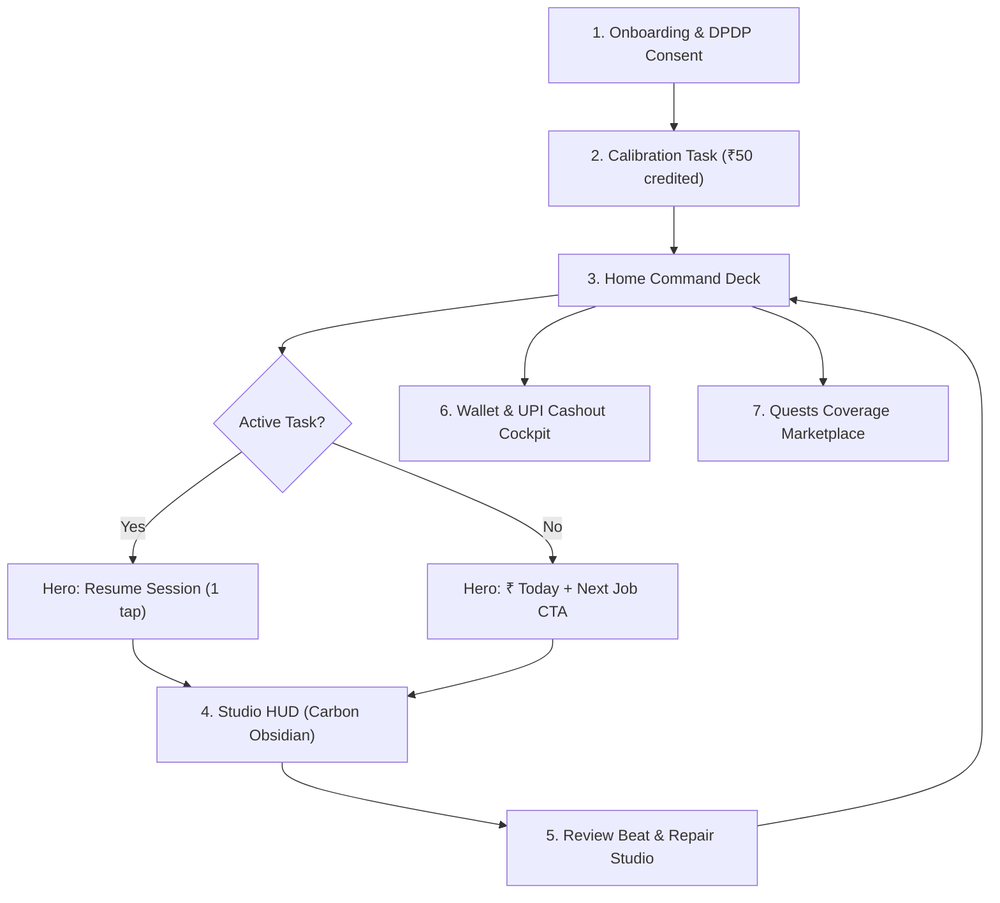

# Feul — Final Product Architecture & Design Specification (2026)

> **The Definitive Source of Truth for UX Architecture, Visual Craft, and Implementation**  
> **Status:** Locked & Authoritative.  
> **Scope:** End-to-end design system, complete Information Architecture (IA), user journeys, screen specifications, acoustic identity, and adaptive engineering.  
> **Target Device Benchmark:** ₹9,000 Android (Redmi / Galaxy A), 360px viewport, 300-nit LCD, 38°C daylight, greasy glass — progressively enhanced for iPhone 16 Pro.

---

## 1. Executive Vision & Anti-Slop Manifesto

### 1.1 The Product Thesis: Coverage, Not Raw Hours
Feul is a precision data marketplace where vernacular Indian contributors build foundational datasets for enterprise AI labs (Sarvam AI, AI4Bharat, Bhashini).
* **The Industry Reality**: AI models fail in India not because they lack raw audio hours, but because they lack **demographic and acoustic coverage** (e.g. 45+ Vidarbha Marathi female speakers recorded in real-world ambient café noise).
* **The Economic Rule**: Same work = same base pay. Contributor standing unlocks higher-value campaigns and faster settlement, but never changes the base rate of an identical clip.
* **The Withdrawal Floor**: ₹100 flat floor, **guaranteed reachable in session 1** (₹50 calibration + ₹50 first guided task).

---

### 1.2 The Anti-Slop & Anti-Dribbble Manifesto
In the hyper-competitive 2026 market, junior portfolios fail by adopting either "2023 Dribbble Clay/Crypto Slop" or "2018 Sterile Gray Wireframes". Feul rejects both extremes through four immutable design laws:

```
┌────────────────────────────────────────────────────────────────────────┐
│                        THE 4 IMMUTABLE LAWS                            │
├────────────────────────────────────────────────────────────────────────┤
│ 1. SEMANTIC PURITY OF DARKNESS:                                        │
│    Bone Linen (#FAF7F2) is the universal ground.                       │
│    Carbon (#12100E) is strictly reserved for the Studio Capture HUD.   │
│    Darkness means one thing: "The mic is hot and recording."           │
│    No dark mode. No dark cards on the Home screen.                     │
├────────────────────────────────────────────────────────────────────────┤
│ 2. ZERO DECORATIVE ILLUSTRATION BUDGET:                                │
│    No cartoon mascots. No stock vectors. No 3D clay toys.              │
│    Visual identity comes from acoustic telemetry, precision typography,│
│    and data infographics.                                              │
├────────────────────────────────────────────────────────────────────────┤
│ 3. THE 4-STEP SEPARATION LADDER (KILLING 167 BORDERS):                 │
│    Step 1: Whitespace (Free, default separation)                       │
│    Step 2: Background Tint Shift (3-5% tone contrast)                  │
│    Step 3: Diffuse Ambient Elevation (Key + Ambient, carbon-tinted)    │
│    Step 4: Hairline 1px Rule (Last resort only)                        │
├────────────────────────────────────────────────────────────────────────┤
│ 4. "ONE APP, TWO DEVICES" ADAPTIVE RENDERING:                          │
│    One IA and one token set. Low-end Android gets flat rendering       │
│    and solid sheets; flagship iOS gets spring physics and haptics.     │
└────────────────────────────────────────────────────────────────────────┘
```

---

## 2. Token Architecture & Craft Engineering

### 2.1 Color Palette & Semantics

```css
/* --- PRIMITIVE RAMPS (oklch-tuned) --- */
--t-terracotta-500: #E06C3A; /* Primary brand action & active sound */
--t-terracotta-600: #C4622D; /* Pressed button fills */
--t-carbon-900:     #201611; /* Primary ink on light; Studio ground */
--t-carbon-700:     #5C4A3E; /* Secondary ink; muted hardware */
--t-carbon-200:     #E9E0D6; /* Subtle dividers & borders */
--t-bone-50:        #FAF7F2; /* Page ground (daylight trust) */
--t-bone-0:         #FFFFFF; /* Raised card surfaces */
--t-verdigris-500:  #3D6B5E; /* Settled payment & verified trust */
--t-ochre-500:      #C8922E; /* In-review & pending queue */
--t-crimson-500:    #8E2434; /* Rejection, noise fault, mic clipping */

/* --- SEMANTIC TOKENS --- */
--surface-ground:   var(--t-bone-50);
--surface-raised:   var(--t-bone-0);
--surface-studio:   #12100E;
--text-primary:     var(--t-carbon-900);
--text-secondary:   var(--t-carbon-700);
--action-primary:   var(--t-terracotta-600);
--state-settled:    var(--t-verdigris-500);
--state-pending:    var(--t-ochre-500);
--state-failed:     var(--t-crimson-500);
```

### 2.2 Typography Scale (11 Steps — Anek Superfamily)
* **Font UI**: `'Anek Latin', 'Anek Devanagari', 'Anek Tamil', system-ui, sans-serif`
* **Font Script (Studio)**: `'Anek Devanagari', 'Anek Tamil', system-ui, sans-serif`
* **Indic Metric Rule**: `--lh-deva: 1.72` and `--lh-taml: 1.72` must be applied to all vernacular blocks to prevent matra clipping.

| Token | Size (px) | Weight | Line Height | Tracking | Use Case |
| :--- | :--- | :--- | :--- | :--- | :--- |
| `text-eyebrow` | 11 | 800 | 1.4 | +0.09em | Uppercase metadata tags |
| `text-caption` | 12 | 600 | 1.45 | +0.02em | Timestamps, secondary chips |
| `text-meta` | 14 | 500 | 1.5 | +0.01em | Table descriptions, subtitles |
| `text-body` | **16** | 500 | 1.5 | 0 | **Absolute floor for all body text** |
| `text-lead` | 18 | 600 | 1.5 | 0 | Lead mission instructions |
| `text-title-card` | 20 | 700 | 1.35 | -0.005em | Bento card titles |
| `text-title-section`| 24 | 700 | 1.3 | -0.01em | Section headers |
| `text-title-screen` | 30 | 700 | 1.2 | -0.015em | Screen titles |
| `text-prompt-studio`| 26 | 700 | 1.72 | 0 | **Teleprompter recording script** |
| `text-money-hero` | **48** | 700 | 1.0 | -0.025em | **One per screen max (tabular-nums)** |
| `text-money-max` | **64** | 700 | 1.0 | -0.03em | **First earning celebration only** |

### 2.3 Radii & Smooth Elevation Discipline
* **Radii (4 values only)**:
  * `--r-sm: 8px` (Chips, tags, small inputs)
  * `--r-md: 14px` (Standard cards, bento tiles, list rows)
  * `--r-lg: 24px` (**Strictly ONE hero object per screen**)
  * `--r-full: 999px` (Action pills, trigger capsules, avatars)
* **Elevation (M3 Carbon-Tinted Shadows)**:
  * `--e-0`: `none` (Default cards on bone ground)
  * `--e-1`: `0 1px 3px rgba(32, 22, 17, 0.06), 0 1px 2px rgba(32, 22, 17, 0.04)` (Inputs, chips)
  * `--e-2`: `0 1px 3px rgba(32, 22, 17, 0.06), 0 8px 20px -6px rgba(32, 22, 17, 0.08)` (The single hero object)
  * `--e-3`: `0 2px 6px rgba(32, 22, 17, 0.08), 0 16px 32px -10px rgba(32, 22, 17, 0.12)` (Bottom sheets)
  * `--e-glow`: `0 0 0 1px rgba(224, 108, 58, 0.12), 0 8px 32px rgba(224, 108, 58, 0.28)` (**Studio trigger capsule ONLY**)

---

## 3. The Acoustic Design Identity & Waveform Engine

The waveform is Feul’s proprietary visual signature. It is not an animation; it is an **acoustic instrument**.

```
       4px min (noise floor)
       │
       ▼  ┌─┐             ┌─┐
       ┌─┐│ │     ┌─┐     │ │     ┌─┐
       │ ││ │ ┌─┐ │ │ ┌─┐ │ │ ┌─┐ │ │
───────┴─┴┴─┴─┴─┴─┴─┴─┴─┴─┴─┴─┴─┴─┴─┴─────────── (Baseline)
        ▲  ▲
        │  │
        3px width + 3px gap (1:1 ratio)
```

### 3.1 Waveform Geometry
1. **Pill Bars**: Width: 3px, Gap: 3px, Radius: 999px.
2. **The 4px Floor**: The bars never drop to 0px. In silence, they hold a 4px resting pill to indicate: *"The mic is alive, listening, and calibrated."*
3. **Peak Containment**: Capped at 32px maximum height.

### 3.2 Dynamic Color States
* **Resting / Ambient Noise**: `--t-carbon-700` (`#5C4A3E`).
* **Active Vocal Energy**: `--t-terracotta-500` (`#E06C3A`).
* **High Resonance Crest**: `--t-ochre-500` (`#C8922E`).
* **Clipping / Distortion (>85dB)**: `--t-crimson-500` (`#8E2434`) — warning to step 15cm back.
* **Validated Audio**: `--t-verdigris-500` (`#3D6B5E`).

### 3.3 Low-End Performance Architecture (The ElevenLabs Hybrid)
* Driven by Web Audio API `AnalyserNode` (`fftSize = 128`) with RMS window smoothing.
* **Rendered entirely inside a single lightweight 2D Canvas context**. Zero DOM node thrashing. Runs locked at 60fps on low-end MediaTek/Snapdragon budget Android chips with <1% CPU load.

---

## 4. End-to-End User Journey & Information Architecture



---

## 5. Screen-by-Screen Deep Specifications

### Screen 1: Onboarding & First Earning Funnel
* **Goal**: Take a first-time, low-trust user from install to **₹50 real money in their wallet** in under 3 minutes.
* **Step 1: Native Language Selection**:
  * Large 56px touch tiles in native scripts: `हिन्दी (Hindi)`, `मराठी (Marathi)`, `தமிழ் (Tamil)`.
* **Step 2: Vernacular DPDP Consent (Data Sovereignty)**:
  * One single screen, plain language, strictly before microphone initialization.
  * Audio playback toggle: *"Listen to how your voice is protected in Marathi."*
  * Clear statutory notice: *"Under DPDP Act 2023, you can delete your voice data anytime. Money paid is never clawed back."*
* **Step 3: Guided Calibration & Mic Setup**:
  * Visual phone-posture guide (Keep phone 15cm from mouth).
  * Contributor speaks 2 calibration phrases. Live canvas waveform provides direct feedback.
* **Step 4: The 64px Celebration Moment**:
  * Contributor finishes. Screen transitions to a calm, dignified celebration:
  * **`₹50.00` counts up in 64px tabular numerals**.
  * Copy: *"First session credited. Complete one more task to unlock ₹100 instant withdrawal."*

---

### Screen 2: Home Screen (The Command Deck)
* **Goal**: Answers one question with zero ambiguity: *"What should I do right now?"*
* **Top Bar**:
  * Left: Contributor avatar + location tag (`[AJ] Alex Joshi · Chandrapur, MH`).
  * Right: Quiet status chip with clickable balance: `[ ₹145.00 ⚡ ]`.
* **The Conditional Hero (The One 24px Object)**:
  * **State A (In-Flight Task Exists)**:
    * The single `--r-lg` hero card on the screen.
    * Client Tag: `⚡ SARVAM AI · MARATHI (VIDARBHA) · 1.4× SCARCITY`.
    * Script Snippet: *"आजच्या बैठकीत नवीन प्रकल्पावर चर्चा करण्यात आली..."*
    * Progress Pill Bar: `[❚❚❚❚❚░░░░] 5 of 8 turns completed · ₹65 accumulated`.
    * Primary Action: `[ ● Resume Session (2 mins) ]` (Terracotta 52px button).
  * **State B (No Task In-Flight)**:
    * Hero amount: `text-money-hero` **48px tabular ink figure** (`₹185.00 Earned Today`).
    * Direct Action Button: `[ Record Marathi Phrases · ₹15 ]` (1 tap directly into Studio).
* **The 6px Waveform Divider**:
  * Replaces gray lines; establishes tactile acoustic presence.
* **The 2x2 Bento Format Grid**:
  * Clean, borderless white cards (`#FFFFFF`) on Bone ground with 1.75px Lucide plumbing:
    * 🎙️ **Short Lines** (`₹15` · 1-2 min reading prompts · Quick Turn)
    * 💬 **Scenario Roleplay** (`₹45` · 2-person conversational roleplay · 1.4× Surge)
    * 👥 **360° Room Take** (`₹220` · 🔒 Unlocks at 25 accepted clips · High Value)
    * 🎧 **Validator Queue** (`₹5/clip` · Grade audio quality · Instant Credit)
* **District Coverage Meter**:
  * Chandrapur District Benchmark: `62% filled (380 clips still needed Friday)`.

---

### Screen 3: The Recording Studio HUD
* **Goal**: Distraction-free, zero-fatigue acoustic capture environment.
* **Ground**: **Carbon Obsidian (`#12100E`) strictly**.
* **Top Telemetry Bar**:
  * `[✕ Exit]` · `TURN 5 OF 8` · `[₹65.00]` · `[ 15cm OK 🟢 ]`.
* **The Teleprompter**:
  * Set in **Anek Devanagari 26px bold (`#FBEFE4`) with `--lh-deva: 1.72`**.
  * Guaranteed 14:1 contrast ratio. Perfectly legible on low-nit screens.
* **The Live Acoustic Waveform**:
  * Sits directly below the prompt. 2D Canvas engine with 3px pill bars pulsing in Terracotta.
* **The Trigger Capsule (72px)**:
  * `--r-full` capsule with `--e-glow` ambient ring.
  * Idle: *"Tap to record"*. Active: Concentric breathing ring with live duration timer.
* **Inline Repair Studio**:
  * If a clip has a noise spike, the contributor sees a discreet banner: *"Traffic noise detected on turn 4. Retake turn 4 or submit all?"* Avoids discarding good work.

---

### Screen 4: Wallet & Payout Cockpit
* **Goal**: Absolute financial transparency; answers *"What happened to my money?"*
* **No Giant 52px Rupee Monument**: Home owns today's money; Wallet owns the **full financial ledger**.
* **The 2x2 Bento Financial Grid**:
  * **Available to Cashout**: `₹145.00` (Direct UPI transfer ready).
  * **In Review (<24h)**: `₹92.00` (3 clips clearing overnight).
  * **This Week**: `₹1,240.00` (↑ 22% vs. last week).
  * **All-Time Earned**: `₹4,850.00`.
* **Weekly Earnings Bar Chart Infographic**:
  * 7 vertical pill bars representing Mon–Sun. Tapping any bar filters the ledger below.
* **The Direct UPI Cashout Card**:
  * Displays linked VPA: `rahul.sharma@okhdfcbank` with green verification badge.
  * Action Button: `[ WITHDRAW ₹145.00 VIA INSTANT IMPS ]`.
  * **Below Floor Rule**: If balance < ₹100, button is visible but disabled with exact gap: `₹35 more to withdraw`.
* **Itemized Audit Ledger**:
  * Real transaction rows showing: Format, Lab Client, Timestamp, Amount, and Settlement status (Verdigris check for IMPS UTR, Ochre for in-review).

---

### Screen 5: Quests & Marketplace
* **Goal**: Expose real-time macroeconomic demand from AI foundation labs.
* **Demand Banners**: Honest supply targets (e.g. *"Sarvam needs 400 more Vidarbha clips to close benchmark Friday"*).
* **Aspirational Tier Gates**:
  * Locked campaigns are never grayed out like dead code.
  * Card displays full pay (`₹220.00`), client identity, and clear unlock path: *"Unlocks at 25 accepted clips — you have 18."*

---

## 6. Pre-Flight Checklist (Everything Needed to Build)

Before modifying code, the project must satisfy these technical gates:

- [ ] **CSS Token Purity**: `theme.css` has only semantic variables; legacy aliases mapped cleanly.
- [ ] **Anek Fonts Active**: `index.html` loads Anek superfamily with preconnect.
- [ ] **Lucide Plumbing Locked**: Icons set to 1.75px stroke; no raw SVG downloads.
- [ ] **Acoustic Canvas Primitive Ready**: `Waveform.tsx` uses 2D Canvas engine with 4px resting floor.
- [ ] **Copy Caps Enforced**: Titles $\le$ 20 characters, CTAs $\le$ 15 characters (Jony standard).
- [ ] **Viewport Harness**: Verified at 360px width without horizontal overflow.
