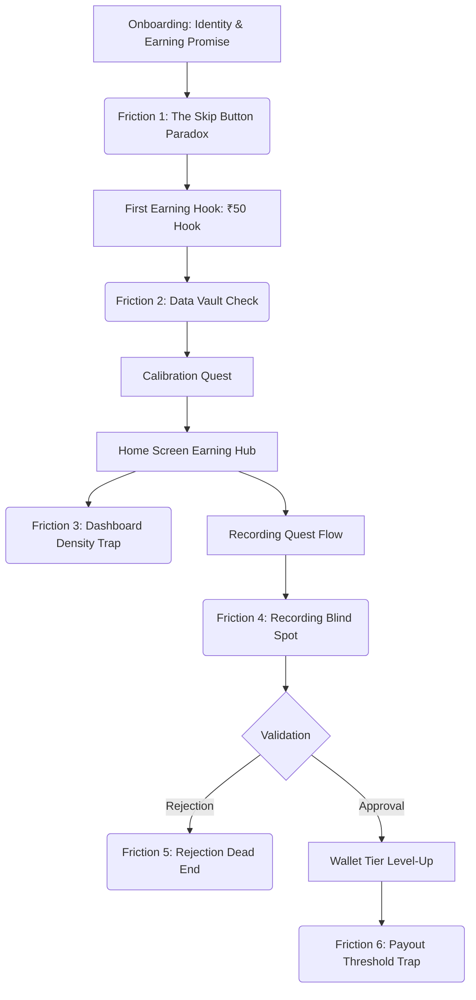

# Executive Summary: The 2026 Product Design Paradigm

This document presents a comprehensive, high-fidelity design and UX audit of **Feul Mobile** from the perspective of a Senior Staff Product Designer. 

In **2026**, the design landscape has shifted dramatically. AI-native design tools and generative interfaces have commoditized standard, clean layouts. "Clean SaaS UI" is no longer a differentiator; it is table stakes. What sets elite mobile products apart is **extreme craft, visual momentum, tactile depth, and sensory micro-feedback**. 

Feul Mobile is a high-stakes, trust-critical platform. Gig workers must believe that their physical effort (speaking into a microphone) instantly and honestly translates into real currency (INR). While Feul's strategic decision to pivot from abstract gamification (points) to concrete liquidity (rupees first) is a masterclass in behavioral design, **the visual implementation and UX flows are currently lagging behind modern design standards.**

This audit breaks down the aesthetic flaws, visual craft gaps, and critical UX friction points, providing actionable Figma-ready redesign recommendations to elevate Feul Mobile into a premium, world-class mobile experience.

---

# 1. Visual Craft & Aesthetic Audit

Currently, Feul Mobile operates on a functional but standard layout style. It feels like a solid web-based prototype, but lacks the organic, high-end "visual authority" expected in 2026.

## 1.1 Typographic Hierarchy & The "Single Font" Bottleneck
> [!WARNING]
> The app currently maps `--font-sans`, `--font-serif`, and `--font-mono` exclusively to a single typeface: **`Plus Jakarta Sans`** (in `src/styles/theme.css`). This creates severe visual monotony.

*   **The Issue**: There is no contrast between decorative display text, body reading text, and numeric ledger values. Tabular currency readouts (e.g., `₹1,250` or `₹185/₹500`) are rendered in the standard proportional body font. This makes numeric values look soft, floating, and unauthoritative.
*   **The 2026 Standard**: Premium fintech and AI-native apps use a **dual-typeface system** to partition visual layers:
    *   **Brand Display**: A high-personality, geometric sans or editorial grotesque (e.g., `Bricolage Grotesque` or `Outfit`) for large headings.
    *   **Tabular Ledger**: A high-density monospaced font (e.g., `Space Mono` or `JetBrains Mono`) for all financial, duration, and progress metrics to give them an industrial, immutable, and high-fidelity "bank ledger" feel.
*   **Actionable Redesign**:
    ```css
    /* 2026 Dual-Type System Proposal */
    --font-sans:    'Plus Jakarta Sans', system-ui, sans-serif; /* Body copy & labels */
    --font-display: 'Bricolage Grotesque', system-ui, sans-serif; /* Headings */
    --font-mono:    'Space Mono', monospace; /* Currency, streak counts, timers */
    ```

## 1.2 Color Space & Luminous Depth (Oklch Migration)
*   **The Issue**: The primary brand color, Orange (`#E06C3A`), is rendered in the legacy sRGB color space. While highly energetic, it feels flat and lacks depth on modern OLED mobile displays. Cards use static off-white backgrounds with solid 1px borders (`#EDF0F5`), making them look like boxy desktop elements squeezed onto a mobile viewport.
*   **The 2026 Standard**: Elite interfaces utilize the **Oklch color space** to create perceptually uniform color gradients that preserve luminance. Interfaces utilize **glassmorphism, satin gradients, and dynamic depth mapping** rather than grey container borders.
*   **Actionable Redesign**:
    *   Upgrade the brand orange to an luminous vermillion glow: `oklch(0.63 0.25 34)`.
    *   Replace boxy 1px light borders with subtle **inner box-shadow strokes** (chameleon borders) that absorb the background color:
        ```css
        box-shadow: 0px 4px 12px rgba(28, 36, 52, 0.03), inset 0px 1px 0px rgba(255, 255, 255, 0.6);
        ```
    *   Introduce soft glowing container layers during active earning cycles, giving the earner a subconscious feeling of premium performance.

## 1.3 Immersive Sensory Feedback
*   **The Issue**: When the user is recording or calibrating (`Recording.tsx`), the visual waveform is a simple representation. There is no biological connection between the speaker's vocal amplitude and the interface's behavior.
*   **The 2026 Standard**: AI voice systems must feel **hyper-reactive**. The app's design system should treat sound as a physical material.
*   **Actionable Redesign**:
    *   Implement an interactive WebGL or SVG canvas waveform that morphs dynamically based on real-time microphone input frequency (Fast Fourier Transform).
    *   Provide immediate haptic click pulses (via mobile Taptic Engine) as the user speaks, mimicking a high-end physical recording deck.

---

# 2. End-to-End UX Flow & Friction Audit



## 2.1 Flow A: Onboarding & First Earning Hook
*Pathways: [Onboarding.tsx](file:///d:/portfolio%20porjects/feul%20final%20build/Feulmobile-main/src/app/components/Onboarding.tsx) → [FirstEarning.tsx](file:///d:/portfolio%20porjects/feul%20final%20build/Feulmobile-main/src/app/components/FirstEarning.tsx)*

### UX Friction 1: The "Skip" Button Paradox
*   **Flaw**: Both Onboarding and First Earning screens contain a tiny, text-only grey "Skip" button in the upper-right corner. Tapping this drops the user into the `Home` screen. For a first-time contributor, skipping the calibration quest leaves them in an empty state, while returning users are forced to see onboarding unless they find this hidden skip button.
*   **Staff Designer Critique**: A "Skip" button in an earning flow is a leaky bucket. It signals that the step is optional or unimportant, directly undermining the primary marketing hook ("Earn ₹50 in 30 seconds"). Furthermore, the lack of an explicit, prominent "Log In / Restore Session" link forces returning users to navigate onboarding slides.
*   **Redesign Option**: 
    1.  Eliminate the generic "Skip" button.
    2.  Replace it with a persistent, styled **"Returning User? Sign In"** action link at the bottom of slide 1.
    3.  If a new user tries to exit the calibration hook, display a bottom sheet with a high-intent micro-copy: *"You're leaving ₹50 on the table. Calibration takes only 30 seconds. Resume Calibration / Go to Feed (unlocked)."*

---

## 2.2 Flow B: The Consent & Calibration Phase
*Pathways: [DataConsent.tsx](file:///d:/portfolio%20porjects/feul%20final%20build/Feulmobile-main/src/app/components/DataConsent.tsx) → [VoiceCalibration.tsx](file:///d:/portfolio%20porjects/feul%20final%20build/Feulmobile-main/src/app/components/VoiceCalibration.tsx)*

### UX Friction 2: Consent Checkbox & Cognitive Friction
*   **Flaw**: To proceed to recording, the user is presented with a legalistic data consent screen, culminating in a mandatory custom checkbox. If they click "I Agree" without checking the box, a harsh red error is shown.
*   **Staff Designer Critique**: The goal of a premium user interface is to convert cognitive friction into a feeling of absolute security. Forcing a checkbox is a legacy web pattern that breaks the immersive flow of a mobile application.
*   **Redesign Option**: Convert the checkbox action into a **swipe-to-approve gesture button** (similar to modern banking transfer interfaces).
    *   The button reads: `Swipe to Consent & Start Recording`. 
    *   This physical action increases user agency, feels extremely premium, and programmatically ensures consent without annoying error states.
    *   *Visual Polish*: As the user swipes the button, a green glow reveals from left to right, validating the action dynamically.

---

## 2.3 Flow C: Contributor Dashboard & Wallet
*Pathways: [Home.tsx](file:///d:/portfolio%20porjects/feul%20final%20build/Feulmobile-main/src/app/components/Home.tsx) → [Wallet.tsx](file:///d:/portfolio%20porjects/feul%20final%20build/Feulmobile-main/src/app/components/Wallet.tsx)*

### UX Friction 3: The "Dashboard Dump" (Information Overload)
*   **Flaw**: The current home screen attempts to represent everything: time-based greetings, daily goals, lifetime earnings, active bonus countdowns, streak badges, quest list previews, recent activity ledger entries, and level-up progress indicators.
*   **Staff Designer Critique**: This is a classic cognitive overload anti-pattern. Mobile screens are vertical and scrolled. When every element screams for attention, the user looks at none. Gig workers are hyper-transactional: they open the app with high intent to find a high-paying task and exit. The "Daily Progress Ring" takes up 40% of the visible viewport while actual money earning actions are pushed below the fold.

```
Current Desktop-like Layout:        2026 Immersive Mobile Architecture:
┌─────────────────────────────┐     ┌─────────────────────────────┐
│  Greeting / Streak Pill     │     │  Vibrant Luminous Header    │
│  [Daily Goal Progress Ring] │     │  Monospaced Balance: ₹1,250 │
│  [Bonus Timer! 8 min left]  │     │ ┌─────────────────────────┐ │
│  =========================  │  => │ │ PRIMARY CTA: START   │ │
│  [Start Earning Now Button] │     │ └─────────────────────────┘ │
│  Picked for you Quest Cards │     │  Gestural Quest Feed (Drag) │
└─────────────────────────────┘     └─────────────────────────────┘
```

*   **Redesign Option**: Consolidate the home page into three clean, focused gestural views:
    *   **The Main Hub**: Clean luminous header, monospaced wallet balance (`₹1,250.00`) as the absolute hero element, and a single high-intent microphone action button.
    *   **The Feed Layer**: Drag up from the bottom to seamlessly pull up the `Quests Feed` as an interactive, search-filtered bottom drawer.
    *   **The Status Center**: Move leveling, badges, and gamified XP progress fully into the `Profile` tab. Keep the home screen focused strictly on task execution and financial feedback.

### UX Friction 4: The Bronze Payout Trap
*   **Flaw**: In `Wallet.tsx`, first-time "Bronze" users can only withdraw 60% of their earnings in cash, with 40% held as "platform credit" to prevent fraud.
*   **Staff Designer Critique**: For an app that sells "trust," this is a massive bait-and-switch. If a user completes their ₹50 calibration quest and tries to withdraw it, discovering that 40% (₹20) is locked behind a "Bronze cliff" will immediately destroy their trust, causing them to churn and mark the platform as a scam.
*   **Redesign Option**: 
    1.  **Exempt the Calibration Reward**: The calibration ₹50 must be 100% withdrawable immediately. Treat this as a marketing acquisition loss-leader. It is the absolute proof-of-work for the platform's honesty.
    2.  **Reframe the Hold**: For subsequent quests, do not call the locked portion "Platform Credit." Reframe it as a **"Security Clearance Queue"** or **"Validator Verification Reserve."** Explain that once they hit Silver (50 clips), the reserve clears instantly.

---

## 2.4 Flow D: Recording & Rejection Loop
*Pathways: [Recording.tsx](file:///d:/portfolio%20porjects/feul%20final%20build/Feulmobile-main/src/app/components/Recording.tsx) → [RejectedTask.tsx](file:///d:/portfolio%20porjects/feul%20final%20build/Feulmobile-main/src/app/components/RejectedTask.tsx)*

### UX Friction 5: The "Black Box" Recording Experience
*   **Flaw**: When recording a quest prompt, the user is blind. They speak into a static interface and submit. Only hours later, a validator rejects it for "background traffic noise," granting them a tiny 10% "Effort Credit."
*   **Staff Designer Critique**: Late feedback is bad design. In 2026, an app that relies on high-quality input must perform **real-time edge validation**.
*   **Redesign Option**: 
    *   Integrate a lightweight, on-device audio checker directly in `Recording.tsx`.
    *   If the user's background noise is too high or volume is clipping, display instant haptic/visual guidance *during the recording itself* (e.g., *"Speak louder,"* or *"Traffic hum detected — try a quieter room"*). 
    *   This shifts validation from a punitive post-process rejection to a real-time supportive coaching pattern.

### UX Friction 6: The "Rejected Task" Dead End
*   **Flaw**: When a task is rejected, the user lands on a screen saying *"Rejected — Background noise detected"* with a button to return to the feed.
*   **Staff Designer Critique**: Rejections feel like failures, killing user motivation. Forcing the user to completely discard their work and start a new 10-prompt quest from scratch is extremely punitive.
*   **Redesign Option**: Implement **Selective Repairs**.
    *   Instead of rejecting an entire quest because prompt 4 out of 10 had background noise, allow the validator to flag *only prompt 4*.
    *   The user's rejected flow should load their existing recording, highlight prompt 4 in red, and say: *"9 of your clips are perfect! Just re-record this one to unlock your ₹25."* This preserves effort, builds tremendous trust, and keeps them in the flow.

---

# 3. Role Transitions & Professional Loops
*Pathways: [ValidatorApplication.tsx](file:///d:/portfolio%20porjects/feul%20final%20build/Feulmobile-main/src/app/components/ValidatorApplication.tsx) → [GradingTask.tsx](file:///d:/portfolio%20porjects/feul%20final%20build/Feulmobile-main/src/app/components/validator/GradingTask.tsx)*

## 3.1 Flow E: The Validator Triage Loop
### UX Friction 7: Validator Decision Fatigue
*   **Flaw**: In `GradingTask.tsx`, a validator is presented with an audio clip and a 5-step horizontal segmented control (Red to Green) to grade the quality. They repeat this for 40-50 clips in a single session.
*   **Staff Designer Critique**: A 5-point scale requires the validator to make a highly subjective judgment on every single clip (e.g., *"Is this a 3 or a 4?"*). Over a 50-clip session, this leads to immense **cognitive drift** and decision fatigue. The validator's accuracy drops, rendering the data unreliable.
*   **Redesign Option**: Implement a **Two-Tier Triage Flow**.
    *   **Tier 1: Binary Gate (Swipe)**: For 90% of clips, the validator should simply check for basic compliance. Swipe Left to Reject (unintelligible, AI-generated, wrong language), Swipe Right to Pass. This builds rapid muscle memory (clip 40 takes 0.5 seconds).
    *   **Tier 2: Graduated Quality**: Only if a clip is passed but has minor issues (e.g., low volume), show a secondary, quick tap-picker for specific tags (e.g., `[Low Volume]`, `[Minor Hesitation]`). This eliminates subjective numbering scales entirely.

---

# 4. Figma-Ready Design Audit & Action Items

| Component | Current State | 2026 Target | Figma Action Item | Priority |
| :--- | :--- | :--- | :--- | :--- |
| **Typography** | Proportional sans (`Plus Jakarta Sans`) used for everything. | Dual-system: Sans for body, Monospace (`Space Mono`) for financial ledger layers. | Assign all currency labels & streak metrics to monospace in global text styles. | **High** |
| **Containers & Cards** | Boxy containers with light borders (`#EDF0F5`) and flat, hard grids. | Frosted glassmorphism, luminous inner-shadow strokes, responsive color gradients. | Replace solid card strokes with double-layer drop shadows and 0.5px white inner borders. | **Medium** |
| **Onboarding CTA** | Regular tap button; tiny grey "Skip" buttons floating in header. | High-fidelity **Swipe-to-Approve** gesture track; explicit returning user entrance. | Design an interactive sliding button widget for consent approval. | **High** |
| **Home Screen** | Massive progress ring clogging viewport; low information density for task actions. | Immersive Earning Hub. Balance is the hero; gestural sliding drawer for quest feeds. | Create a gestural card prototype where dragging reveals the secondary quest layer. | **High** |
| **Recording Feedback** | Static waveform; hours-delayed validation. | On-device edge-validation with real-time vocal feedback gauges. | Design real-time micro-states for "Too Loud," "Too Quiet," and "Ideal Room Level." | **High** |
| **Rejection Screen** | Hard stop rejection; discard work, restart quest feed. | Selective Repair workflow. Re-record only the flawed prompt segment. | Draft a "Repair State" layout showing successfully validated slots alongside a single red corrective slot. | **High** |
| **Validator Interface** | Complex 5-point subjective grading scales. | Triage Swipe architecture (Binary pass/fail) with quick contextual tag lists. | Prototype a rapid swipe-to-grade interface modeled after fluid mobile gestures. | **Medium** |

---

# 5. Designer's Strategic Recommendation: The 2026 Vision

> [!TIP]
> **The North Star**: Feul Mobile's core advantage is that it treats gig workers as *co-builders* of the AI era rather than faceless laborers. The interface design must physically manifest this respect.

Moving forward in your Figma file, prioritize creating a **vocal feedback engine** and a **seamless repair workflow**. By transforming rejections into cooperative fixes, Feul Mobile will build an unmatched brand loyalty among global gig workers, creating a highly stable, high-fidelity supply chain of conversational data that AI companies will pay a massive premium to acquire.
